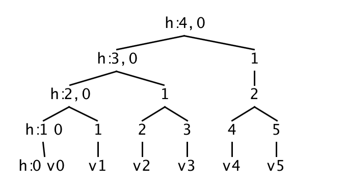
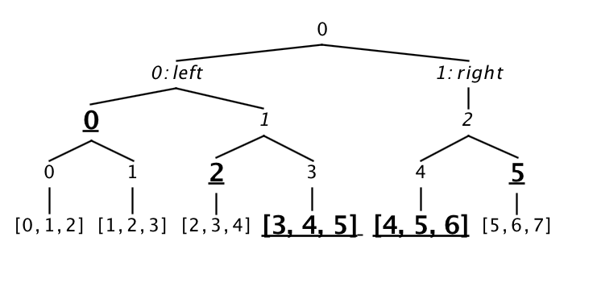

# Merkelized List

[**Merkelized list**](../architecture/storage.md#prooflistindex) is a version
of a typed list that supports compact proofs of existence for its elements using
Merkle trees. Merkelized lists in Exonum are designed as classic binary Merkle trees
within the persistence module, but can also be viewed as append-only lists
by [client](../architecture/clients.md)
and [service](../architecture/services.md) developers.

A [Merkle tree][wiki-merkelized-list] (aka hash tree or Tiger tree hash)
is a [tree][wiki-tree] in which every non-leaf node is labelled with the hash
of the labels or values (in case of leaves) of its child nodes. Hash trees are
a generalization of hash lists and chains. Merkle trees include both benefits of

1. **Trees**: operations on elements (appending a new element, getting an
  element) take `O(log N)` operations, where `N` is number of elements
  (for example, transactions)
2. **Hashes**: verification of the (blockchain) copies.

## Motivation and Usage

In the blockchain as in various other distributed and [peer-to-peer][wiki:p2p]
systems, data verification is very important because the same data
exists in multiple locations. Thus, if a piece of data is changed in one
location, it's important that the same data changes are processed everywhere
in the same way.

It is time consuming and computationally expensive to check the
entirety of each part whenever a system wants to verify data. This is why
Merkle trees are used. Basically, the use of Merkle trees limits
the amount of data being sent over a network as much as possible.
Instead of sending an entire file
over the network, it's possible just send a hash of the file to see if it matches.

Currently, the main uses of Merkle trees are in peer-to-peer networks such
as [Tor][tor] and [Bitcoin][bitcoin]. The usage of Merkle tree for blockchains
(including Bitcoin and Exonum) is twofold:

- Minimization of the data transfer during the blockchain state agreement
  during *Precommit* phase of the
  [consensus algorithm](../architecture/consensus.md)
- Possibility of [light clients](../architecture/clients.md)
  implementation.

## `ProofListIndex` Storage Specification

Operator `||` below stands for concatenation. Function `hash(arg)` below
stands for [SHA-256][sha-256] hash of byte array `arg`.

### Persistence

The internal representation of a Merkle tree is organized by utilizing 2 integer
parameters as a key for each element: `height` and `index`.

!!! note
    To distinguish values from different lists in Exomum, an additional prefix is
    used for every key. Consult
    [storage section](../architecture/storage.md) for more details.

1. Each Merkle tree element is addressed by an 8-byte `key = height || index`,
  where:
    - `height < 58` is height of element in the tree, where `0` is leaf, and is
      represented as `6` bits
    - `index` is index of element at the given height consisting of `58` bits
    - `height` and `index` are serialized within `key` as
      [big-endian][wiki:big-endian]
2. The elements of the underlying list are stored in `(height = 0, index)`
  cells, where `index` is in interval `[0, list.len())` and
  `list.len()` is the number of leaves in the tree (or, equivalently, the
  number of elements in the underlying list).
3. Hash of a tree leaf is stored in `(height = 1, index)`.
  It corresponds to the tree leaf stored in `(height = 0, index)`.
4. Some of the rightmost intermediate nodes may have a single child; it's not
  required that the obtained tree is full binary. Appending an element to the
  list corresponds to writing it to the cell `(0, list.len())` and updating
  `O(log list.len())` nodes of the tree with `height > 0`.
5. A node at `(height > 1, index)` stores hashes of 1 or 2 child nodes.
    - If both `(height - 1, index * 2)` and `(height - 1, index * 2 + 1)`
      nodes are present, the node `(height, index)` has 2 children hashes.
    - If only `(height - 1, index * 2)` node is present, the
      node at `(height, index)` has single child hash.
6. `max_height` is the minimal height at which only a single hash is stored at
  `index = 0`.
    - `max_height = pow + 1`, where `pow` is the smallest integer such that
      `2^pow >= list.len()`
    - `(max_height, 0)` defines *the root hash* of the Merkle tree.

An example of `key -> value` mappings in database.

Key | Height | Index | Value
------------|-------------:|-------------:|-------------
**00** **00** **00** **00** **00** **00** **00** **FF** |  0 | 255 | serialized value
**04** **00** **00** **00** **00** **00** **00** **05** |  1 | 5   | hash
**0C** **00** **00** **00** **00** **00** **00** **0A** |  3 | 10  | hash

### Logical Representation

Below is an illustration of the logical representation of a Merkle tree,
containing `6` values `v0...v5`.



### Hashing Rules

Let `T(height, index)` be a value at tree node for element `index` at height
`height`. Elements `T(0, index)` contain serialized values of the undelying list
according to [the Exonum binary serialization spec](../architecture/serialization.md).
Elements `T(height, index)` for `height > 0` are hashes corresponding the following
rules.

#### Rule 1. Empty tree

Hash of an empty tree is defined as 32 zero bytes.

#### Rule 2. `height=1`

Hash of a value, contained in `(height = 0, index)`, is defined as:

```none
T(1, index) = hash(T(0, index)).
```

#### Rule 3. `height > 1`, two children

If `height > 1` and both nodes `T(height - 1, index * 2)` and
`T(height - 1, index * 2 + 1)` exist then:

```none
T(height, index) = hash(T(height-1, index*2) || T(height-1, index*2+1)).
```

#### Rule 4. `height > 1` and the only child

If `height > 1`, node `T(height - 1, index * 2)` exists and
node `(height - 1, index * 2 + 1)` is absent in the tree, then:

```none
T(height > 1, index) = hash(T(height - 1, index * 2)).
```

## Merkle Tree Proofs

### General Description

`Proofnode` is a recursively defined structure that's designed to provide
evidence to client that a certain set of values is contained in a contiguous
range of indices. One could use several `Proofnode`s to get proof for
discontiguous set of indexes.

For a given range of indices `[start_index, end_index)` the proof
has a binary-tree-like structure, which contains values of elements from
the leaves with requested indices and hashes of all neighbor tree nodes
on the way up to the root of tree (excluding the root itself). `Proofnode` doesn't
contain the indices themselves, as they can be deduced from the structure
form.

### Format

A `Proofnode<Value>` is defined to be one of the following (in terms of JSON values):

Variant | Child indices | Hashing rule
------------ | ------------- | -------------
{ "left": `Proofnode`, "right": `Proofnode` } | `left_i = 2*i`, `right_i = 2*i + 1` | [3](#hashing-rules)
{ "left": `Proofnode`, "right": `Hash` } | `left_i = 2*i`, `right_i = 2*i + 1` | [3](#hashing-rules)
{ "left": `Proofnode` } | `left_i = 2*i` | [4](#hashing-rules)
{ "left": `Hash`, "right": `Proofnode` } | `left_i = 2*i`, `right_i = 2*i + 1` | [3](#hashing-rules)
{ "val": `ValueJson` } | `val_i = i` | [2](#hashing-rules)

1. `Hash` is a hexadecimal encoded string representing a hash.
2. An option without the right hash `{"left": Proofnode}` is present due to how
  trees, which are not full binary, are handled in this implementation.
3. `i` is the index of a `Proofnode` itself. `left_i`, `right_i` and
  `val_i` are the indices of the nested (child) `Proofnode`(s).
4. `i` for the outmost `Proofnode` is 0.
5. Custom functions to compute `val` hash for each individual entity type are
  required on client. Each function should construct a byte array from
  `ValueJson` fields using [Exonum serialization spec](../architecture/serialization.md)
  and compute the hash of `val` according to [2](#hashing-rules).

### Proof Verification

While validating the proof a client is required to verify the following conditions:

1. All of the `{"val": ...}` variants are located at the same depth in the
  retrieved JSON.
2. If a node contains a right child (i.e., matches either of
  `{"left": ..., "right": ...}` variants), then its left child, nor any of its
  children may have a single child (i.e., match the `{"left": ...}` variant).
  This means that the left child must be a result of pruning a full binary
  tree.
3. Collected indices of `ValueJson`(s) in proof correspond to the requested
  range of indices `[start_index, end_index)`.
4. The root hash of the proof evaluates to the root hash of the `ProofListIndex`
  in question.

If either of these verifications fails, the proof is deemed invalid.

!!! note
    One could think of proofs as of Merkle trees pruning. That is, a proof is
    produced by "collapsing" some intermediate nodes in the Merkle tree.
    Another point of view - from the light client perspective - is that a proof
    is essentially a limited view of a list, for which the Merkle tree is
    constructed. This view allows to calculate the hash of the whole list and
    contains some of its elements.

#### Example

Below is depicted a Merkle tree with `6` elements (i.e., not full binary) with
elements, that are a saved inside a proof for range `[3, 5)` in
**bold\_and\_underscored** on the bottom. The elements of the underlying Merkelized
list are `3`-byte buffers `[u8; 3]`.



This proof corresponds to the following JSON representation:

```JSON

{
  "left": {
    "left": "fcb40354a7aff5ad066b19ae2f1818a78a77f93715f493881c7d57cbcaeb25c9",
    "right": {
      "left": "1e6175315920374caa0a86b45d862dee3ddaa28257652189fc1dfbe07479436a",
      "right": {
        "val": [
          3,
          4,
          5
        ]
      }
    }
  },
  "right": {
    "left": {
      "left": {
        "val": [
          4,
          5,
          6
        ]
      },
      "right": "b7e6094605808a34fc79c72986555c84db28a8be33a7ff20ac35745eaddd683a"
    }
  }
}
```

## See Also

1. Merkle, R. C. — A Digital Signature Based on a Conventional Encryption
  Function // Advances in Cryptology — CRYPTO '87. Lecture Notes in Computer
  Science, Vol. 293, pp. 369-378, 1988.
2. Szydlo, M. — Merkle Tree Traversal in Log Space and Time // Lecture Notes in
  Computer Science, Vol. 3027, pp. 541-554, 2004.
3. [Merkle tree on Brilliant](https://brilliant.org/wiki/merkle-tree/).

[wiki-merkelized-list]: https://en.wikipedia.org/wiki/Merkle_tree
[wiki-tree]: https://en.wikipedia.org/wiki/Tree_(data_structure)
[wiki:p2p]: https://en.wikipedia.org/wiki/Peer-to-peer
[bitcoin]: https://bitcoin.org/bitcoin.pdf
[tor]: https://www.torproject.org/
[wiki:git]: https://en.wikipedia.org/wiki/Git
[wiki:big-endian]: https://en.wikipedia.org/wiki/Endianness
[sha-256]: http://nvlpubs.nist.gov/nistpubs/FIPS/NIST.FIPS.180-4.pdf
