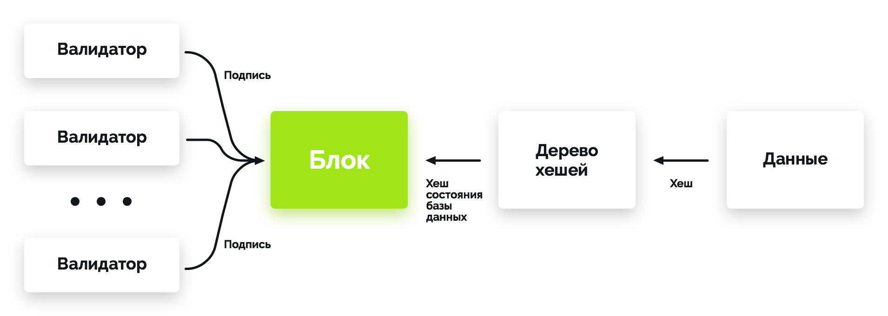

# Lightweight Clients

To improve system auditability, Exonum includes a [**light
client**](https://github.com/exonum/exonum-client). Light client is a
JavaScript library with a number of helper functions available for use by
frontend developers. These helper functions are used to
verify blockchain responses on the client side using cryptographic proofs.

The client functions are divided into the following submodules:

- **Data**. Functions for [serialization and deserialization of
  data](serialization.md) from the JSON format to
  Exonum binary format
- **Cryptography**. Functions for calculating hashes, creating
  and validating digital signatures
- **Proofs**. Functions for checking cryptographic proofs that
  are returned by the blockchain, such as the functions for
  checking the proofs for [Merkle][mt-index]
  and [Merkle Patricia][mpt-index] indices
- **Blockchain integrity checks**. Function for checking the
  validity of a block (its compliance with [consensus algorithm](consensus.md))

!!! note
    A hash of the entire blockchain state is a part of each block
    (see [data storage](storage.md)). This hash is formed using Merkle
    and Merkle Patricia indices. Thus, using functions for proof verification,
    one can verify the commitment of any blockchain data in a block. The block
    itself can be verified using blockchain integrity verification.

There are two typical use cases for the light client:

- Forming and sending transactions to the Exonum blockchain network
- Forming [requests](services.md#read-requests) to full nodes of the network
  (normally, HTTP GET requests) and validation of the responses

## Transaction Creation

In this and next section all functions indicated in *italics* are the functions
implemented in Exonum light client.

1. On triggering frontend application (for example, by a button click handler)
  a new transaction is created. The transaction data is stored in JSON format.
  Then the data is *converted to the Exonum binary format* and
  *digitally signed* using the light client library.
2. Frontend application receives a digital signature from
  the light client library.
3. The generated transaction (JSON data + the digital signature) is sent
  to a full node via an HTTP POST request.
4. Frontend application receives a notification (e.g., the transaction hash)
  as a response to the HTTP POST request

!!! note
    Serialization during signing is a necessary step, since all
    data (including transactions) is stored in Exonum in a [custom binary
    format](serialization.md). This is done for several reasons:

    - The binary format is unambiguous, while the same data can have multiple
      JSON representations (which would lead to different hashes of logically
      the same data)
    - The data stored in the binary format consumes less disk space
    - Access to a field in a binary format can be implemented using fast
      pointer arithmetic; the same operation for JSON data would require
      multiple reads

## Sending Requests

1. The client forms an HTTP GET request and sends it
  to a full node in the Exonum blockchain network.
2. The node forms a response to the request and the corresponding
  cryptographic proof and sends both back to the client.
  The cryptographic proof includes a block header together with
  [`Precommit` messages](consensus.md#precommit)
  that certify its validity, and one or more
  [Merkle paths](../glossary.md#merkle-proof)
  that link the response to the block header.
3. On receiving the response from the blockchain, the client
  *verifies the structure* and *validates cryptographic proofs*
  of the response.
  The verification procedure includes *checking whether a returned response
  is stale*. This is accomplished by calculating the median of timestamps
  recorded in `Precommit`s and comparing it against the local time
  of the client.
  If the median time in `Precommit`s is too far in the past, the response
  is considered stale, and its verification fails.
4. The result of checks and the data retrieved from the full node is shown
  in the user interface

!!! note
    In case user authentication is needed (for example, for data
    access management), requests can be *digitally signed*.

An example of the cryptographic proof:

In this figure, the data has a [serializable](serialization.md) datatype
known to the frontend application.
It is tied to [the blockchain state](../glossary.md#blockchain-state)
via one or more [Merkle trees](../glossary.md#merkle-tree) or their variants.
The hash digest of the blockchain state is a part of the block signed
by the blockchain validators.

## Motivation

Blockchain, as a technology that expands the capabilities of distributed
databases, implies the possibility of auditing or validating stored
information. This audit can be done in several ways.

In a system with full nodes (nodes that store the full copy of a blockchain),
audit can be performed automatically during operation of such nodes. When a new
block is received, a full node verifies its compliance with the
consensus algorithm and the correctness of transaction execution. Such an
audit by dedicated auditor nodes can be effective in case it is performed
by external independent parties. However, it has a number of drawbacks:

- To perform audit, one needs a full copy of a blockchain and
  enough computational resources to stay in sync with the blockchain validators
- This type of audit needs to be permanent to ensure the correctness of
  system state
- In order to start auditing, a full auditor node must reach the current height
  of the blockchain. This could take long time, especially if
  the blockchain has substantial transaction throughput
- An end user of the system is forced to trust pair validators +
  auditors, since he has no way to verify the correctness of blockchain
  data. As a matter of fact, such blockchain is equal to distributed database
  from the user’s point of view.

One of the ways to address the drawbacks of audit by dedicated auditor
nodes is to introduce *light clients*, also known as
*lightweight clients*, *thin clients* or just *clients*. For the Bitcoin
blockchain, these clients are also known as [SPV (simple payment verification)
clients](https://en.bitcoin.it/wiki/Thin_Client_Security). Light clients are
programs able to replicate and verify a small portion of information stored
in the blockchain. Usually clients verify information relevant to a specific
user (for example, the history of his transactions). This verification is
possible due to the use of specific data containers in a blockchain:
[Merkle][mt-index] and [Merkle Patricia][mpt-index] indices.

Advantages of this approach are:

- **Decreased trust in third parties**: verification of
  all data returned by a blockchain in response to queries is performed by the
  user himself on his machine
- Constant (albeit partial) audit of the system is possible without requiring
  computational resources comparable to validators in terms of performance.
  Only the relevant data is audited
- To start or resume the audit of the system, no synchronization period is
  required

!!! note
    The user still needs to trust the light client developers if the client
    has closed source. Alternatively, the user should perform an
    audit of light client code to remove the necessity of trust to
    third parties completely.

The presence of light clients does not mean the absence of auditor nodes, since
their tasks are different. Light clients verify particular user's data, while
auditor nodes verify a blockchain as a whole.

Light client security could be compared to [TLS][wiki:tls] security checks
embedded into web browsers. It is not a direct substitute to auditing performed
by auditor nodes, but it provides a measurable degree of security against
[MitM attacks][wiki:mitm] and maliciously acting nodes that the client
may communicate with. At the same time, if light clients cover
all blockchain transactions, their *collective* security can become comparable
to the security provided by the auditor nodes.

The presence of light clients in a blockchain-based system leads to certain
difficulties during development:

- Backend developers should agree with client developers on API requests and
  the format of cryptographic proofs
- Changes in blockchain data model should be accompanied by relevant
  changes in the logic of proof verification performed by light clients

These problems above can be overcome with the aid of data
schema stated in a language-independent format
(see [the Exonum roadmap](../roadmap.md)).

Despite the complexity of the development, the presence of
light clients in a blockchain-based system is the only practical way to
largely remove the necessity of trust to third parties.

[wiki:tls]: https://en.wikipedia.org/wiki/Transport_Layer_Security
[wiki:mitm]: https://en.wikipedia.org/wiki/Man-in-the-middle_attack
[mt-index]: storage.md#prooflistindex
[mpt-index]: storage.md#proofmapindex
