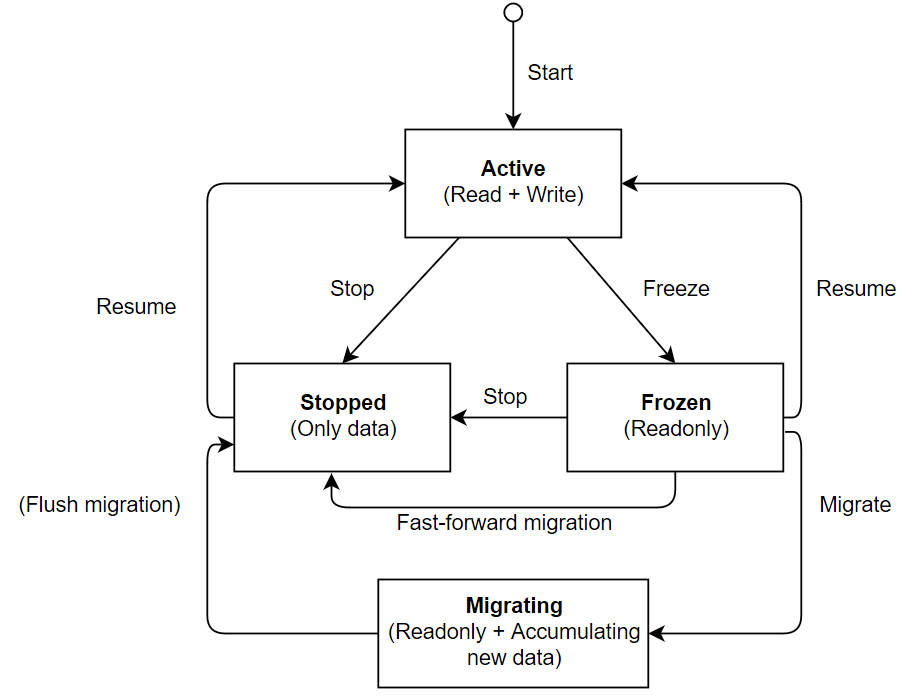

# Service Lifecycle

[Services and artifacts](services.md) have a well-defined lifecycle,
which allows to evolve business logic during blockchain operation.

## Artifacts

Recall that artifacts are necessary to instantiate services. Their lifecycle
is dictated by the assumption that artifact deployment may be lengthy
(since it may involve compilation, network I/O etc.) and its results
may diverge on different nodes of the network.

1. An artifact is assembled in a way specific to the runtime. For example,
  an artifact may be compiled from sources and packaged using an automated
  build system.

2. The artifact is deployed on the blockchain.
  The decision to deploy the artifact and the deployment spec are performed
  by the blockchain administrators. The corresponding logic is customizable
  via the supervisor service. What deployment entails depends on the runtime;
  e.g., the artifact may be downloaded by each Exonum node, verified for integrity
  and then added into the execution environment.

3. For each node, an artifact may be deployed either asynchronously or synchronously,
  that is in a blocking manner. The supervisor usually first commands a node
  to deploy the artifact asynchronously, once the decision to start deployment
  is reached by the blockchain administrators. Asynchronous deployment speed
  and outcome may differ among nodes.

4. The supervisor translates the local deployment outcomes into
  a consensus-agreed result. For example, the supervisor may collect confirmations
  from the validator nodes that have successfully deployed the artifact.
  Once all the validator nodes have sent their confirmations, the artifact is *committed*.
  As a part of the service logic, artifact commitment is completely deterministic,
  agreed via consensus, and occurs at the same blockchain height for all nodes
  in the network.

5. Once the artifact is committed, every node in the network must have it deployed
  in order to continue functioning.
  If a node has not deployed the artifact previously, deployment becomes blocking.
  The node does not participate in consensus or block processing
  until the deployment is completed successfully. If the deployment is unsuccessful,
  the node stops indefinitely. The deployment confirmation mechanics is built
  into the supervisor. Thus, it is reasonable to assume that a deployment failure
  at this stage is local to the node and could be fixed by the node admin.

## Service Instances

1. Once the artifact is committed, it is possible to instantiate services
  from it.
  Each instantiation request contains an ID of the previously deployed artifact,
  a string instance ID, and instantiation arguments in a binary encoding
  (by convention, Protobuf). As with the artifacts, the logic that control
  instantiation is encapsulated in the supervisor service.

2. During instantiation the service gets a numeric ID, which is used to reference
  the service in transactions. The runtime can execute initialization logic defined
  in the service artifact; e.g., the service may store some initial data
  in the storage, check service dependencies, etc. If the service
  (or the enclosing runtime) signals that the initialization failed,
  the service is considered not instantiated.

3. Once the service is instantiated, it can process transactions and interact
  with the external users in other ways. Different services instantiated
  from the same artifact are independent and have separate blockchain storages.
  Users can distinguish services by their IDs; both numeric and string IDs
  are unique within a blockchain. Note that the transition to the "active" state
  is not immediate; see [*Service State Transitions*](#service-state-transitions)
  section below.

4. Active service instances can be *stopped* or *frozen* by a corresponding request
  to the core.

A **stopped** service no longer participates in business logic, i.e.,
it does not process transactions or hooks, and does not interact with the users
in any way. Service data becomes unavailable for the other services,
but still exists. The service name and identifier remain reserved
for the stopped service and can't be used again for adding new services.

**Frozen** service state is similar to the stopped one, except the service
state can be read both by internal readers (other services) and external ones
(HTTP API handlers).

The core logic is responsible for persisting artifacts and services
across node restarts.

The transitions among possible service states (including data migrations
we discuss [below](#data-migrations)) are as follows:

### Service State Transitions

Transitions between service states (including service creation) occur
once the block with the transition is committed; the effect of a transition
is not immediate. This means that, for example, an instantiated service
cannot process transactions or internal calls in the block with instantiation,
but can in the following block. Likewise, the service hooks are *not* called
in the block with service instantiation.

When the service is stopped or frozen, the reverse is true:

- The service continues processing transactions until the end of the block
  containing the stop or freeze command
- The service hooks *are* called for the service in this block

## Data Migrations

Recall that [data migrations](services.md#data-migrations) are needed to
make old service data work with the new version of service logic (that is,
a new artifact version).

Exonum recognizes two kinds of migrations:

- **Fast-forward migrations** synchronously change the version
  of the artifact associated with the service. A fast-forward migration is performed
  if the updated artifact signals that it is compatible with the old service data.
- Migrations that require changing data layout via
  [migration scripts](../glossary.md#migration-script) are referred
  to as **async migrations**.

For a migration to start, the targeted service must be stopped or frozen, and
a newer version of the service artifact needs to be deployed
across the network.

Fast-forward migrations do not require any special workflow to agree migration
outcome among nodes; indeed, the outcome is agreed upon via the consensus algorithm.
The artifact associated with the service instance is changed instantly.

In contrast, async migrations have the following dedicated workflow:

1. Migration is *initiated* by a call from a supervisor. Once a block with
  this call is merged, all nodes in the network retrieve the migration script
  and start executing it in a background thread. The script may execute
  at varying speed on different nodes.

2. After the script is finished on a node, its result becomes available
  in the node storage. Nodes synchronize these results using supervisor
  (e.g., via broadcasting transactions).

3. Once the consensus is built up around migration, its result is either
  *committed* or the migration is *rolled back*. Right below, we consider
  commitment workflow; the rollback workflow will be described slightly later.

4. Committing a migration works similarly to artifact commitment.
  It means that any node in the network starting from a specific
  blockchain height must have migration completed with a specific outcome
  (i.e., hash of the migrated data). A node that does not have
  migration script completed by this moment will block until the script
  is completed. If the local migration outcome differs from the committed one,
  the node will be unable to continue participating in the network.

5. After migration commitment, migration can be *flushed*, which will replace
  old service data with the migrated one. Flushing is a separate call
  to the dispatcher; it can occur at any block after the migration commitment
  (since at this point, we guarantee that the migration data is available
  and is the same on all nodes).

6. After the migration is flushed, the service returns to the "stopped" status.
  The service can then be resumed with the new data, or more migrations
  could be applied to it.

If the migration is rolled back on step 3, the migrated data is erased,
and the service returns to the "stopped" status. The local migration result
is ignored; if the migration script has not completed locally, it is aborted.

!!! note
    Deciding when it is appropriate to commit or roll back a migration
    is the responsibility of the supervisor service. For example, it may commit
    the migration once all validators have submitted identical migration results,
    and roll back a migration if at least one validator has reported an error
    during migration or there is divergence among reported migration results.
