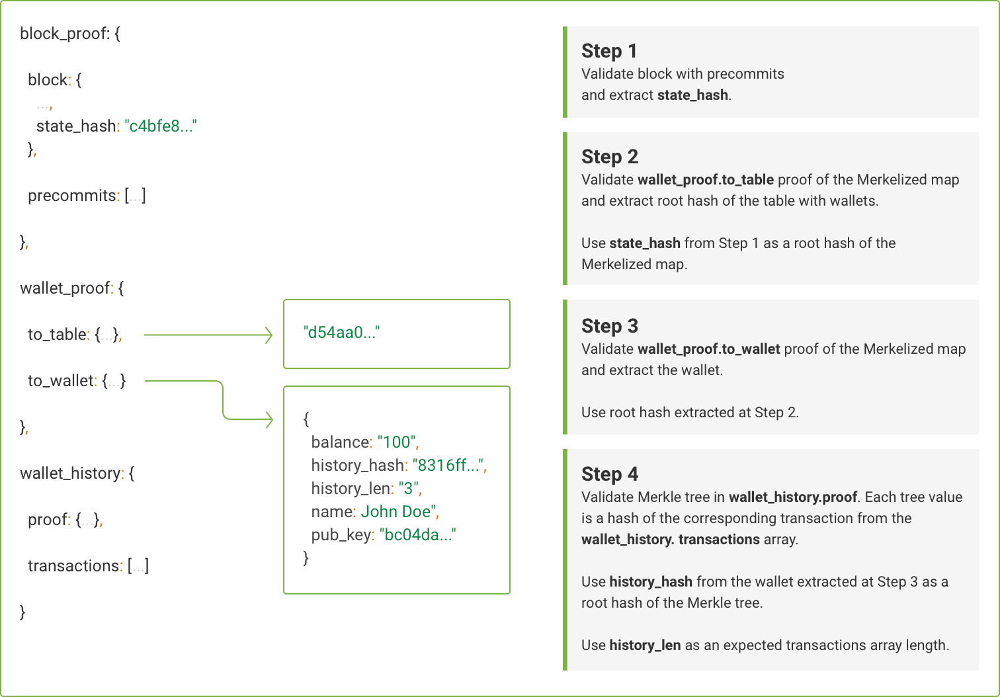

# Managing Exonum Services with the Help of Light Client

In this tutorial we describe how to use the light client to interact with Exonum
services. The tutorial extends other tutorials:
[Service with Data Proofs](data-proofs.md)
and, partly, [Exonum Timestamping Demo][timestamping-demo].

Light client is a JavaScript library used for a number of purposes:

- forming and sending transactions to the blockchain
- creating digital signatures over transactions
- obtaining and checking cryptographic proofs of data authenticity and
  integrity.

Below we will provide you with the detailed description of how said
functionality is executed in Exonum light client.

## Before You Start

To start using Exonum light client, include [exonum-client][javascript-client]
into your JavaScript application. Please refer to this detailed guide
for instructions on how to customize your client. The present tutorial will
show you the ready-made examples of the client use.

## Execute a Transaction

A transaction is an atomic operation that introduces changes to the blockchain
state. The structure, contents and number of transaction types within one
service vary depending on the business logic of each service.

The general algorithm of executing a transaction in Exonum includes 4 stages:

- define transaction schema with its data types
- define transaction data
- generate a signing key pair (if required) and sign the transaction
- send transaction to the blockchain.

Below we provide two examples of transaction execution in Exonum services.

### Create Timestamping Transaction

As stated in our [guide for the light client][javascript-client-nested-types],
a custom data type can be a field of other custom data type without limitation
as to the depth of the nested data.

In view of the above, in the Timestamping demo we start defining the transaction
with the `Timestamp` entity itself. Said entity is further applied as a custom
type within `CreateTimestamp` transaction schema:

```javascript
const Timestamp = Exonum.newType({
  fields: [
    { name: 'content_hash', type: Exonum.Hash },
    { name: 'metadata', type: Exonum.String }
  ]
})
```

- `content_hash` - is a sha256 hash of some data or file to be stamped
- `metadata` - is an optional description of the data to be stamped that is
  included into the stamp.

Define `CreateTimestamp` transaction schema and field types:

```javascript
const CreateTimestamp = Exonum.newMessage({
  protocol_version: 0,
  service_id: 130,
  message_id: 0,
  fields: [
    { name: 'pub_key', type: Exonum.PublicKey },
    { name: 'content', type: Timestamp }
  ]
})
```

- `protocol_version` - represents the major version of the Exonum
  serialization protocol. Currently, `0`;
- `service_id` - represents the identifier of the service. Can be found in
  service sources;
- `message_id` - represents the identifier of the transaction type in the
  service. Corresponds to the index number of the transaction in service
  sources, starting with `0`;
- `fields` - represents the fields of the transaction. In this case it contains
  two fields:
    - `pub_key` - author's public key;
    - `content` - object of `Timestamp` type defined above.

Next, generate a signing key pair for signing and sending the transaction.

```javascript
const keyPair = Exonum.keyPair()
```

!!! note
    In our Timestamping demo we generate a new signing key pair for each new
    timestamp. In the Service with Data Proofs we generate a key pair that
    corresponds to a certain wallet and its user and, thus, is applied for
    signing all transactions made on its behalf.

Prepare transaction data according to the above-defined schema:

```javascript
const data = {
  pub_key: keyPair.publicKey,
  content: {
    content_hash: hash,
    metadata
  }
}
```

Sign the transaction with the secret key from key pair generated above:

```javascript
const signature = CreateTimestamp.sign(keyPair.secretKey, data)
```

Finally, send the resulting transaction into the blockchain using built-in
`send` method which returns a `Promise`:

```javascript
const transactionHash = await CreateTimestamp.send(transactionEndpoint,
  explorerBasePath, data, signature)
```

- `transactionEndpoint` - represents API address of transaction handler at a
  blockchain node. Example:

  `http://127.0.0.1:8200/api/services/timestamping/v1/timestamps`

- `explorerBasePath` - represents API address of transaction explorer where
  you can see transaction details at a blockchain node. Example:

  `http://127.0.0.1:8200/api/explorer/v1/timestamps/value?hash=`

### Transaction for Transferring Funds from One Wallet to Another

To execute this type of transaction you need to create two wallets:
sender and receiver.

Define `TransferFunds` transaction schema and data types:

```javascript
const TransferFunds = Exonum.newMessage({
  protocol_version: 0,
  service_id: 128,
  message_id: 0,
  fields: [
    { name: 'from', type: Exonum.PublicKey },
    { name: 'to', type: Exonum.PublicKey },
    { name: 'amount', type: Exonum.Uint64 },
    { name: 'seed', type: Exonum.Uint64 }
  ]
})
```

As you might know from our very first [Cryptocurrency demo](create-service.md),
in order to transfer funds from one wallet to another a "seed" is included
into each such transaction. This prevents transactions from being hacked by
a third person. You can generate seed as follows:

```javascript
const seed = Exonum.randomUint64()
```

Prepare the transaction data according to the above-defined schema. Note that we
identify the sender by the public key of his wallet that was generated when
creating said wallet:

```javascript
const data = {
  from: keyPair.publicKey,
  to: receiver,
  amount,
  seed
}
```

Now you can sign transaction with the sender's secret key from the key pair
generated when creating his wallet and send the resulting transaction into the
blockchain. The methods applied in this case are identical to those shown in the
`CreateTimestamp` transaction from previous example.

## Cryptographic Proofs

The idea behind this functionality is one of the core features of the light
client. Whenever you want to check presence of some data in the blockchain, a
request is made with the light client. The response to the request should
contain your data together with either a cryptographic proof for it or a
corresponding error, if such data is absent in the blockchain for some reason.

In other words, a [cryptographic proof](../glossary.md#merkle-proof)
is a response to the read request made through the light client that:

- validates authenticity of the data contained therein
- certifies that said data is safely stored in the blockchain.

In the same way as transactions, data proofs provided by Exonum light client
have a general common structure and comprise of several parts. Meanwhile,
depending on the service business logic some extra custom parts may be included
therein.

Below, we will discuss the proof from the Service with Proofs which in its
structure repeats the proofs from the Timestamping service plus contains some
custom parts.

The proof itself comprises several levels and, when executed, unfolds from the
highest level down to the lowest one, which is represented by the requested
data. The highest level, evidently, corresponds to the blockchain state hash.

Below is the proof chart representing the proof structure. You can refer to it
while we will be further analyzing it.



Thus, first of all, we check that the block containing our data is correct and
bears the state hash indicated in the proof. For this purpose we load and
format the actual list of public keys of validator nodes stored in the network
[configuration](../architecture/configuration.md). The keys
are applied to assert that the data received from the
blockchain was indeed agreed upon by all the member nodes in the network:

```javascript
const response = await axios.get('/api/services/configuration/v1/configs/actual')


const validators = response.data.config.validator_keys.map(validator => validator.consensus_key)
```

Now make a request for the data on a particular wallet together with its proof.
Note, that we identify the wallet by its public key which is in fact the public
key of its holder:

```javascript
const response = await axios.get(`/api/services/cryptocurrency/v1/wallets/info?pub_key=${publicKey}`)

// response.data contains wallet together with its proof
```

- `publicKey` - public key of the wallet of interest.

As soon as we get the data, as mentioned above, we verify the block where it is
stored, in particular block precommits according to the downloaded set of
keys of the validators:

```javascript
if (!Exonum.verifyBlock(data.block_info, validators)) {
  throw new Error('Block can not be verified')
}
```

Next, we need to obtain the root hash of the table that bears all the registered
wallets from the table containing hashes of all tables
defined in the service (state hash aggregator). The root hashes of the service
tables are
stored as values under their tables keys. To be able to obtain the root hash of
interest we define the table key structure:

```javascript
const TableKey = Exonum.newType({
  fields: [
    { name: 'service_id', type: Exonum.Uint16 },
    { name: 'table_index', type: Exonum.Uint16 }
  ]
})

const tableKey = TableKey.hash({
  service_id: 128,
  table_index: 0
})
```

We also obtain a proof for the state hash aggregator and check presence of the
wallets table root hash therein:

```javascript
const tableProof = new Exonum.MapProof(data.wallet_proof.to_table, Exonum.Hash, Exonum.Hash)
```

- `Exonum.Hash` - represents 1) the key of the wallets table; 2) the value of
  its root hash.

As soon as we detect the wallets table inside the state hash aggregator, we
check if the
obtained `merkleRoot` of the proof is equal to the system state hash stored in
the previously validated block. If so, the present part of the proof is
considered valid:

```javascript
if (tableProof.merkleRoot !== data.block_proof.block.state_hash) {
  throw new Error('Wallets table proof is corrupted')
}
```

We can now extract the root hash of the wallets table from the obtained proof
based on the table key defined above:

```javascript
const walletsHash = tableProof.entries.get(tableKey)

if (typeof walletsHash === 'undefined') {
  throw new Error('Wallets table not found')
}
```

The next proof level is devoted to the validation of existence of a particular
wallet inside the system. The procedure here is similar to the one we faced at
the previous level.

First, we define the structure that we search for in the proof. In this case it
is a wallet. We then obtain the proof down to the required wallet:

```javascript
const Wallet = Exonum.newType({
  fields: [
    { name: 'pub_key', type: Exonum.PublicKey },
    { name: 'name', type: Exonum.String },
    { name: 'balance', type: Exonum.Uint64 },
    { name: 'history_len', type: Exonum.Uint64 },
    { name: 'history_hash', type: Exonum.Hash }
  ]
})

const walletProof = new Exonum.MapProof(data.wallet_proof.to_wallet,
  Exonum.PublicKey, Wallet)
```

Here we also check that `merkleRoot` which is now the root hash of the wallets
table coincides with `walletsHash` we obtained at the previous level. In this
way we can link two parts of the proof:

```javascript
if (walletProof.merkleRoot !== walletsHash) {
  throw new Error('Wallet proof is corrupted')
}
```

If the above is the case, we can safely extract wallet data from the proof:

```javascript
const wallet = walletProof.entries.get(publicKey)

if (typeof wallet === 'undefined') {
  throw new Error('Wallet not found')
}
```

Basically, the proof from the Timestamping demo comprises the same validation
levels as described above. Specifically, to obtain confirmation for the
timestamp data, the proof validates the block, the root table and the table of
timestamps. The data on the timestamp can then be extracted from the validated
timestamps table.

Meanwhile, the proof we presently investigate contains another level that refers
to the validation of transactions in respect of each wallet.  

First, we obtain a proof for all transactions in the wallet. It will contain
transaction hashes as well as statuses thereof. In our example we obtain
information for the whole wallet transaction history, however, any suitable
range may be selected:

```javascript
const TransactionMetaData = Exonum.newType({
  fields: [
    { name: 'tx_hash', type: Exonum.Hash },
    { name: 'execution_status', type: Exonum.Bool }
  ]
})

const transactionsMetaData = Exonum.merkleProof(
  wallet.history_hash,
  wallet.history_len,
  data.wallet_history.proof,
  [0, wallet.history_len],
  TransactionMetaData
)
```

Upon obtainment of the proof, make sure that number of transactions in the
wallet history, that we extracted earlier together with other information on the
wallet, is equal to the number of transactions in the array of the proof.
Otherwise, transactions cannot be verified against the proof:

```javascript
if (data.wallet_history.transactions.length !== transactionsMetaData.length) {
  throw new Error('Transactions can not be verified')
}
```

Next, we validate each transaction. For this purpose we iterate them in the
array and first check them according to their structure. This check allows us
to confirm that a transaction of a certain type is present at a definite place
in the array. In our example, for the sake of brevity, we provide structure
definition of an issue-type transaction only. However, note that all the
transaction types of the service should be defined.

Next, we validate each transaction signature with `Transaction.verifySignature`
method.

Finally, we calculate a hash from a transaction body with `Transaction.hash`
method to compare it with the corresponding hash from the proof.

```javascript
data.wallet_history.transactions.forEach(function(transaction) {
  // generate transaction definition
  const Transaction =  new Exonum.newMessage({
    protocol_version: 0,
    service_id: 128,
    message_id: 2,
    fields: [
      { name: 'from', type: Exonum.PublicKey },
      { name: 'to', type: Exonum.PublicKey },
      { name: 'amount', type: Exonum.Uint64 },
      { name: 'seed', type: Exonum.Uint64 }
    ],
    signature: transaction.signature
  })

  // validate transaction signature
  if (!Transaction.verifySignature(transaction.signature,
    transaction.body.from, transaction.body)) {
    throw new Error('Invalid transaction signature has been found')
  }

  // validate hash
  if (Transaction.hash(transaction.body) !== transactionsMetaData[i]) {
    throw new Error('Invalid transaction hash has been found')
  }
})
```

## Conclusion

We have described all the functionality required to interact with an Exonum
service through the light client so far.

Well done! You have now equipped your application with a full-stack Exonum-based
support! Here is the point where you can build and run your application.

[timestamping-demo]: https://github.com/exonum/exonum/tree/master/examples/timestamping
[javascript-client]: https://github.com/exonum/exonum-client#getting-started
[javascript-client-nested-types]: https://github.com/exonum/exonum-client#nested-data-types
