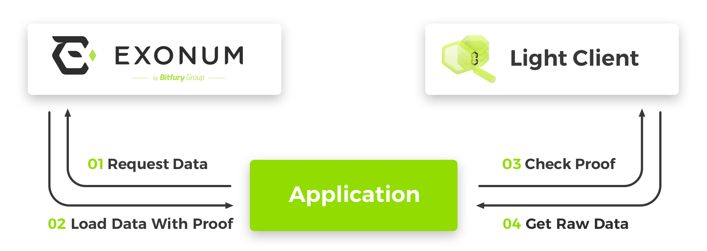

# Cryptographic proofs

A cryptographic proof is a format in which a Exonum node can provide sensitive data from a blockchain.
These proofs are based on [Merkle trees](../glossary/#merkle-tree) and their variants.

Light client validates the cryptographic proof and can prove the integrity and reliability of the received data.

The scheme of interaction between the application and the blockchain:



Read more about design of [cryptographic proofs](../advanced/merkelized-list/) in Exonum.

## Merkle tree

```javascript
var elements = Exonum.merkleProof(rootHash, count, tree, range, type);
```

The `merkleProof` method is used to validate the Merkle tree and extract a **list of data elements**.

| Argument | Description | Type |
|---|---|---|
| **rootHash** | The root hash of the Merkle tree as hexadecimal string. | `String` |
| **count** | The total number of elements in the Merkle tree. | `Number` |
| **proofNode** | The Merkle tree. | `Object` |
| **range** | An array of two elements of `Number` type. Represents list of obtained elements: `[startIndex; endIndex)`. | `Array` |
| **type** | Definition of the elements type. *Optional. The `merkleProof` method expects to find byte arrays as values in the tree if `type` is not passed.* | [Custom data type](data-types/#define-data-type) |

An example of verifying a Merkle tree:

```javascript
var rootHash = '0b0f1916e7bba03e1e9cd8adf004072ef2ff83e41b8646b79ea3ab342c325925';
var count = 3;
var proofNode = {
    left: {
        left: {
            val: {
                firstName: 'John',
                lastName: 'Doe',
                age: 28,
                balance: 2500
            }
        },
        right: '8dc134fc6f0e0b7fccd32bb0f6090e68600710234c1cb318261d5e78be659bd1'
    },
    right: '3b45eedc6952cbec6a8b769c3e50f96d1d059853bbedb7c26f8621243b308e9a'
};
var range = [0, 0];
var user = Exonum.newType({
    size: 21,
    fields: {
        firstName: {type: Exonum.String, size: 8, from: 0, to: 8},
        lastName: {type: Exonum.String, size: 8, from: 8, to: 16},
        age: {type: Exonum.Uint8, size: 1, from: 16, to: 17},
        balance: {type: Exonum.Uint32, size: 4, from: 17, to: 21}
    }
});

var elements = Exonum.merkleProof(rootHash, count, proofNode, range, user); // [{firstName: 'John', lastName: 'Doe', age: 28, balance: 2500}]
```

An example of verifying a Merkle tree with elements passed as byte arrays:

```javascript
var rootHash = '6956f2d3b391b1106e160210de1345c563cbece4199fd13f5c195207e429ff13';
var count = 8;
var proofNode = {
    left: {
        left: {
            left: {val: [1, 2]},
            right: {val: [2, 3]}
        },
        right: {
            left: {val: [3, 4]},
            right: {val: [4, 5]}
        }
    },
    right: {
        left: {
            left: {val: [5, 6]},
            right: {val: [6, 7]}
        },
        right: {
            left: {val: [7, 8]},
            right: {val: [8, 9]}
        }
    }
};
var range = [0, 8];

var elements = Exonum.merkleProof(rootHash, count, proofNode, range); // [[1, 2], [2, 3], [3, 4], [4, 5], [5, 6], [6, 7], [7, 8], [8, 9]]
```

## Merkle Patricia tree

```javascript
var data = Exonum.merklePatriciaProof(rootHash, proofNode, key, type);
```

The `merklePatriciaProof` method is used to validate the Merkle Patricia tree and extract a **data**.

Returns `null` if the tree is valid but data is not found.

| Argument | Description | Type |
|---|---|---|
| **rootHash** | The root hash of the Merkle Patricia tree as hexadecimal string. | `String` |
| **proofNode** | The Merkle Patricia tree. | `Object` |
| **key** | Searched data key as hexadecimal string. | `String` |
| **type** | Definition of the data type. *Optional. The `merklePatriciaProof` method expects to find byte array as value in the tree if `type` is not passed.* | [Custom data type](data-types/#define-data-type) |

An example of verifying a Merkle Patricia tree:

```javascript
var rootHash = '30d4490ced707b82df58490954eb650c4a1ab4f372db79a94e0aa17d53b80a57';
var proofNode = {
    '0010100000011111100101111010100101100110100000010001101000001011001011101111011001100000100110010111001111110000110110000101100000111010110010000101111101010011101100111001010110110001001100011000111110010100110101100111110110110010100001101110011101000001': 'ee41de52614bf7231722361886627d7c3a45c7d463b866355775fe810cd28c79',
    '1': {
        '011100011100101100010101110100010101110111100101010000001010111110011110100111111000111101101011101010111101100001011011001000111111010001001000111011101010000011000110010101101110110011010100010111001111100010001001111110111100000110010101111101010011001': {
            val: {
                firstName: 'John',
                lastName: 'Doe',
                age: 28,
                balance: 2500
            }
        },
        '111000111101010100001011111001101100110011100111010100110101000110100100010011010111101010011000011101110100001001001001000100110100001011111011011111011100000001110001010111011100001110011001100111000011010000001101011000101100111011000100010001110101111': '2d72ab9dd43b7d0ddf2caf8e1afb90cdf60dafad3d55cbbaab7cc96a55bc4f2e'
    }
};
var key = 'f1ea85f36673a9a8d226bd4c3ba12489a17dbee038aee1ccce1a06b1676223af';
var user = Exonum.newType({
    size: 21,
    fields: {
        firstName: {type: Exonum.String, size: 8, from: 0, to: 8},
        lastName: {type: Exonum.String, size: 8, from: 8, to: 16},
        age: {type: Exonum.Uint8, size: 1, from: 16, to: 17},
        balance: {type: Exonum.Uint32, size: 4, from: 17, to: 21}
    }
});

var data = Exonum.merklePatriciaProof(rootHash, proofNode, key, user); // {firstName: 'John', lastName: 'Doe', age: 28, balance: 2500}
```

An example of verifying a Merkle Patricia tree with data passed as byte array:

```javascript
var rootHash = '95d1d8dbad15bb04478fad0c3a9343ac32502ae975858749a8c29cb24cccdd5b';
var proofNode = {
    '0': {
        '0': {
            '0': 'caae9df1efefea2759ae0a3b517d3349706d8784332c2f62c9a098e844165d89',
            '1': {
                '0': {
                    '0': '380b4b821be12d1dfd358182221db9a6a99bcb170352ef35a29f07c2bcff38b3',
                    '1': {
                        '00111011111011001100000101010100010110001001111100100011100101001100100100100000000100100110101111010000111010101100100101000101000011111011000000001110011101011100011101110110000010100101101010001110001000111101100000101010111001100110010010101110111': 'c68961128777db1d16eefeed4c34db888537e11988d1a374578465b6331275fc',
                        '10': {
                            '001010001111110000101101101011111110000101010111001100101110011110010011110000111001011111111011110110100101111111111110111001110011111110011111001110011110111100001100100101110011010010111111011110001001000010000110000001000101101111100000101010100': '4bd3fa4310bed5820402d911d1eccbb707061ec8d289e5729d45b56c8fef4c03',
                            '111010101101111001100001101010000101000000010001000101001111010011000011111100001110100101011111001111101011010100011101111000110001011011010101010110101000011111000110101111100111001110001111010101111011010011011011000001001001111111100110111000011': {
                                val: [36, 49, 15, 31, 163, 171, 247, 217]
                            }
                        }
                    }
                },
                '1': '7b30199821f2250fcbe03a65c09e1709a9aa34b16cb99959f10b4e3b21da95b6'
            }
        },
        '1': 'a69f434e1c3169ebf6c7bff7ca75ede523509ae0f5049d6d91bc3dcc334b6023'
    },
    '1': 'fcfbcd07563e3f04f731a754b92947efbbe6c579667a7cc235c3ee6b2a0bffb0'
};
var key = '2dd5bcc350a02229e987e1d2be7d6a3bc62daab50f8d7ce71eaf69b6093fcdc3';

var data = Exonum.merklePatriciaProof(rootHash, proofNode, key); // [36, 49, 15, 31, 163, 171, 247, 217]
```
