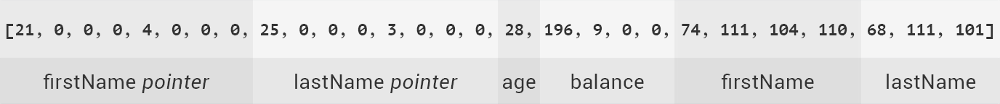

# Serialization

Each serializable data type has its (de)serialization rules, which govern how the instances of this type are
(de)serialized from/to a binary buffer.
Check [serialization guide](../architecture/serialization) for details.

Signature of `serialize` function:

```javascript
type.serialize(data, cutSignature);
```

| Argument | Description | Type |
|---|---|---|
| **data** | Data to serialize. | `Object` |
| **type** | Definition of the field type. | [Custom data type](data-types/#define-data-type) or [transaction](transactions/#define-transaction). |
| **cutSignature** | This flag is relevant only for **transaction** type. Specifies whether to not include a signature into the resulting byte array. *Optional.* | `Boolean` |

An example of serialization into a byte array:

```javascript
// Define a data type
var user = Exonum.newType({
    size: 21,
    fields: {
        firstName: {type: Exonum.String, size: 8, from: 0, to: 8},
        lastName: {type: Exonum.String, size: 8, from: 8, to: 16},
        age: {type: Exonum.Uint8, size: 1, from: 16, to: 17},
        balance: {type: Exonum.Uint32, size: 4, from: 17, to: 21}
    }
});

// Data to be serialized
var data = {
    firstName: 'John',
    lastName: 'Doe',
    age: 28,
    balance: 2500
};


// Serialize
var buffer = user.serialize(data); // [21, 0, 0, 0, 4, 0, 0, 0, 25, 0, 0, 0, 3, 0, 0, 0, 28, 196, 9, 0, 0, 74, 111, 104, 110, 68, 111, 101]
```

The value of the `buffer` array:


