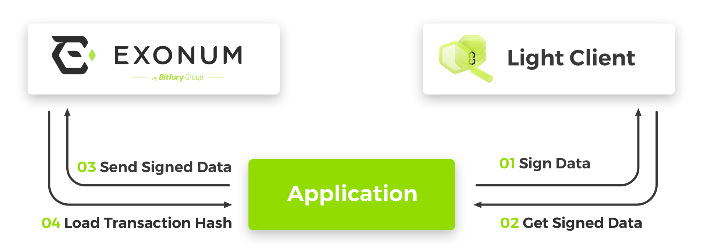

# Transactions

Transaction in Exonum is a operation to change the data stored in blockchain.
Transaction processing rules is a part of business logic implemented on [service](../architecture/services) side.

When creating a transaction on the client side, all the fields of transaction are first described using
[custom data types](data-types/#define-data-type).
Then [signed](signature/#sign-data) using signing key pair.
And finally can be sent to the service.


 
Read more about [transactions](../architecture/transactions) in Exonum. 

## Define transaction

```javascript
var sendFunds = Exonum.newMessage({
    network_id: 0,
    protocol_version: 0,
    service_id: 130,
    message_id: 128,
    size: 72,
    fields: {
        from: {type: Exonum.Hash, size: 32, from: 0, to: 32},
        to: {type: Exonum.Hash, size: 32, from: 32, to: 64},
        amount: {type: Exonum.Uint64, size: 8, from: 64, to: 72}
    }
});
```

**Exonum.newMessage** function requires a single argument of `Object` type with next structure:

| Property | Description | Type |
|---|---|---|
| **network_id** | [Network ID](../architecture/serialization/#network-id). | `Number` |
| **protocol_version** | [Protocol version](../architecture/serialization/#protocol-version). | `Number` |
| **service_id** | [Service ID](../architecture/serialization/#service-id). | `Number` |
| **message_id** | [Message ID](../architecture/serialization/#message-id). | `Number` |
| **signature** | Signature as hexadecimal string. *Optional.* | `String` |
| **size** | The total length in bytes. | `Number` |
| **fields** | List of fields. | `Object` |

Field structure is identical to field structure of [custom data type](data-types/#define-data-type).

## Serialize transaction

An example of serialization into a byte array:

```javascript
// Define a transaction
var sendFunds = Exonum.newMessage({
    network_id: 0,
    protocol_version: 0,
    service_id: 130,
    message_id: 128,
    size: 72,
    fields: {
        from: {type: Exonum.Hash, size: 32, from: 0, to: 32},
        to: {type: Exonum.Hash, size: 32, from: 32, to: 64},
        amount: {type: Exonum.Uint64, size: 8, from: 64, to: 72}
    }
});

// Data to be serialized
var data = {
    from: 'f5602a686807fbf54b47eb4c96b5bac3352a44e7500f6e507b8b4e341302c799',
    to: 'f7ea8fd02cb41cc2cd45fd5adc89ca1bf605b2e31f796a3417ddbcd4a3634647',
    amount: 1000
};

// Serialize
var buffer = sendFunds.serialize(data, true); // [0, 0, 128, 0, 130, 0, 146, 0, 0, 0, 245, 96, 42, 104, 104, 7, 251, 245, 75, 71, 235, 76, 150, 181, 186, 195, 53, 42, 68, 231, 80, 15, 110, 80, 123, 139, 78, 52, 19, 2, 199, 153, 247, 234, 143, 208, 44, 180, 28, 194, 205, 69, 253, 90, 220, 137, 202, 27, 246, 5, 178, 227, 31, 121, 106, 52, 23, 221, 188, 212, 163, 99, 70, 71, 232, 3, 0, 0, 0, 0, 0, 0]
```

Read more about [serialization](serialization).

## Sign transaction

An example of transaction signing:

```javascript
// Define a transaction
var sendFunds = Exonum.newMessage({
    network_id: 0,
    protocol_version: 0,
    service_id: 130,
    message_id: 128,
    size: 72,
    fields: {
        from: {type: Exonum.Hash, size: 32, from: 0, to: 32},
        to: {type: Exonum.Hash, size: 32, from: 32, to: 64},
        amount: {type: Exonum.Uint64, size: 8, from: 64, to: 72}
    }
});

// Data to be signed
var data = {
    from: 'fa7f9ee43aff70c879f80fa7fd15955c18b98c72310b09e7818310325050cf7a',
    to: 'f7ea8fd02cb41cc2cd45fd5adc89ca1bf605b2e31f796a3417ddbcd4a3634647',
    amount: 1000
};

// Define the signing key pair 
var publicKey = 'fa7f9ee43aff70c879f80fa7fd15955c18b98c72310b09e7818310325050cf7a';
var secretKey = '978e3321bd6331d56e5f4c2bdb95bf471e95a77a6839e68d4241e7b0932ebe2b' +
 'fa7f9ee43aff70c879f80fa7fd15955c18b98c72310b09e7818310325050cf7a';

// Sign the data
var signature = sendFunds.sign(secretKey, data); // 'c304505c8a46ca19454ff5f18335d520823cd0eb984521472ec7638b312a0f5b1180a3c39a50cbe3b68ed15023c6761ed1495da648c7fe484876f92a659ee10a'
```

Read more about [data signing](signature/#sign-data).

## Verify signed transaction

An example of signature verification:

```javascript
// Define a transaction
var sendFunds = Exonum.newMessage({
    network_id: 0,
    protocol_version: 0,
    service_id: 130,
    message_id: 128,
    size: 72,
    fields: {
        from: {type: Exonum.Hash, size: 32, from: 0, to: 32},
        to: {type: Exonum.Hash, size: 32, from: 32, to: 64},
        amount: {type: Exonum.Uint64, size: 8, from: 64, to: 72}
    }
});

// Data that has been signed
var data = {
    from: 'fa7f9ee43aff70c879f80fa7fd15955c18b98c72310b09e7818310325050cf7a',
    to: 'f7ea8fd02cb41cc2cd45fd5adc89ca1bf605b2e31f796a3417ddbcd4a3634647',
    amount: 1000
};

// Define a signing key pair 
var publicKey = 'fa7f9ee43aff70c879f80fa7fd15955c18b98c72310b09e7818310325050cf7a';
var secretKey = '978e3321bd6331d56e5f4c2bdb95bf471e95a77a6839e68d4241e7b0932ebe2b' +
 'fa7f9ee43aff70c879f80fa7fd15955c18b98c72310b09e7818310325050cf7a';

// Signature obtained upon signing using secret key
var signature = 'c304505c8a46ca19454ff5f18335d520823cd0eb984521472ec7638b312a0f5b' +
 '1180a3c39a50cbe3b68ed15023c6761ed1495da648c7fe484876f92a659ee10a';

// Verify the signature
var result = sendFunds.verifySignature(signature, publicKey, data); // true
```

Read more about [signature verification](signature/#verify-signature).

## Get a transaction hash

!!! warning
    The transaction must be signed before the hash is calculated.

Example of calculation of a transaction hash:

```javascript
// Define a transaction
var sendFunds = Exonum.newMessage({
    network_id: 0,
    protocol_version: 0,
    service_id: 130,
    message_id: 128,
    size: 72,
    fields: {
        from: {type: Exonum.Hash, size: 32, from: 0, to: 32},
        to: {type: Exonum.Hash, size: 32, from: 32, to: 64},
        amount: {type: Exonum.Uint64, size: 8, from: 64, to: 72}
    }
});

// Data
var data = {
    from: 'fa7f9ee43aff70c879f80fa7fd15955c18b98c72310b09e7818310325050cf7a',
    to: 'f7ea8fd02cb41cc2cd45fd5adc89ca1bf605b2e31f796a3417ddbcd4a3634647',
    amount: 1000
};

// Define a signing key pair 
var publicKey = 'fa7f9ee43aff70c879f80fa7fd15955c18b98c72310b09e7818310325050cf7a';
var secretKey = '978e3321bd6331d56e5f4c2bdb95bf471e95a77a6839e68d4241e7b0932ebe2b' +
 'fa7f9ee43aff70c879f80fa7fd15955c18b98c72310b09e7818310325050cf7a';

// Sign the data
var signature = sendFunds.sign(secretKey, data);

// Add a signature field
sendFunds.signature = signature;

// Get the hash
var hash = sendFunds.hash(data); // '383900f7721acc9b7b45dd2495b28072d203b4e60137a95a94d98289970d5380'
```

Read more about [hashes](hash).
